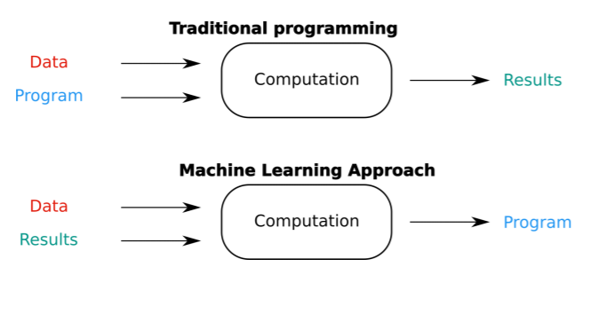

# What is Machine Learning (ML)

Machine Learning is a method where a computer learns patterns from examples instead of following hand-written rules.

- Traditional programming: `Rules + Data -> Answer`

- Machine Learning: `Data + Answers -> Rules (Model)`

Instead of explicitly telling the system how to decide, we let it discover the decision logic by observing mistakes and improving.

### A real-life analogy
Think of teaching a child to recognize dogs:
- You don’t define fur length, ear shape, or tail angle
- You show examples
- The child gets better over time

Key idea:
ML systems learn through error correction, not understanding.

Common beginner misconception
> “The model understands the data”

**No.**

The model optimizes numbers to reduce error.
