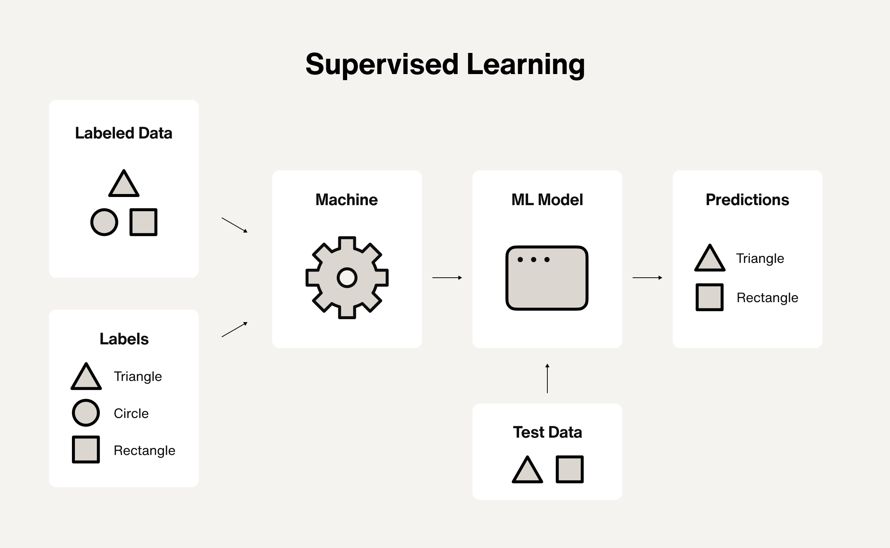
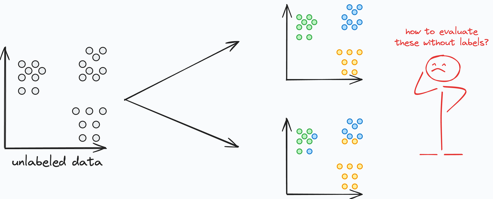
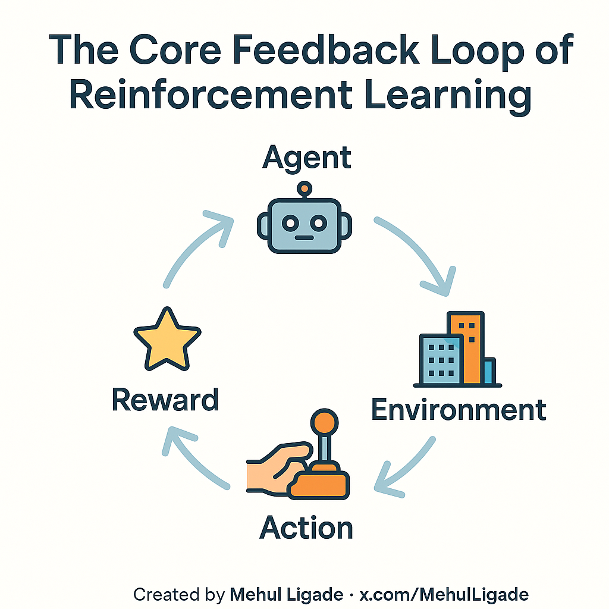

# Types of Machine Learning

Machine learning is categorized by what kind of feedback the model receives.

### 1. Supervised Learning i.e. Learning With Answers

The model is given:
- Input data (features)
- Correct outputs (labels)

It learns by comparing:
> predicted output ↔ actual output

Examples:
- Image → Cat or Dog
- Email → Spam or Not Spam
- Audio → Healthy or Diseased speech

This is the most common form of ML and the focus of early modules.

---

### 2. Unsupervised Learning i.e. Learning Without Answers

The model receives:
- Input data only
- No labels

It tries to:
- Find structure
- Discover patterns
- Group similar samples

Examples:
- Customer segmentation
- Topic modeling
- Dimensionality reduction

**Critical warning:**
> Clusters are not ground truth. They are patterns, not facts.

---

### 3. Semi-Supervised Learning i.e. Learning With Limited Answers

In semi-supervised learning:
- A small portion of the data is labeled
- A large portion remains unlabeled

The model uses labeled data to guide learning from unlabeled data.

Used when:
- Labeling of the entire dataset is expensive
- Human annotation is slow or costly
- Data volume is very large

***Why this matters:***
Many real-world ML systems operate in this regime.

---

### 4. Reinforcement Learning i.e. Learning From Consequences

Reinforcement Learning (RL) is fundamentally different from supervised and unsupervised learning.

Instead of labels, the model learns from:
- Actions
- Rewards or penalties
- Interaction with an environment

How learning happens:
1. The agent takes an action
2. The environment responds
3. The agent receives a reward or penalty
4. The agent updates its behavior to maximize long-term reward

Examples:
- Game-playing agents (chess, Go, Atari)
- Robotics and control systems
- Recommendation systems (at scale)

Key idea:
The model is not told the correct action — it must discover it through trial and error.

Why this matters:
RL optimizes long-term outcomes, not immediate correctness.

---

### Summary: Why the feedback type matters

| Learning Type   | Feedback Given      | Typical Use                     |
| --------------- | ------------------- | ------------------------------- |
| Supervised      | Correct answers     | Classification, regression      |
| Unsupervised    | No answers          | Clustering, structure discovery |
| Semi-supervised | Few answers         | Large-scale real-world data     |
| Reinforcement   | Rewards / penalties | Decision-making, control        |

**Takeaway:**
>What a model can learn is entirely defined by how it receives feedback.

