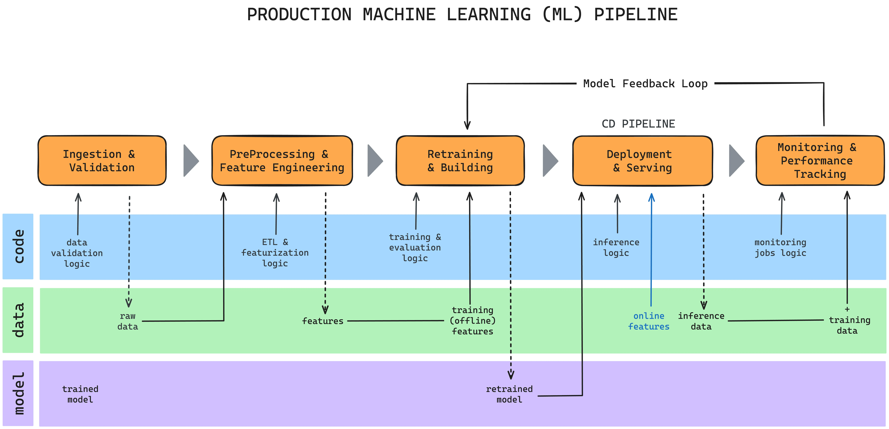

# The Machine Learning Pipeline (The Backbone of Everything)

This is the most important concept in the entire course.

Every ML algorithm — from linear regression to deep neural networks — fits into this pipeline.

The Pipeline Stages:

1. Data
Raw observations (numbers, text, images, audio)

2. Feature Engineering
Transform raw data into useful signals
(example: MFCCs from audio, embeddings from text)

3. Model
A parameterized function that maps inputs → outputs

4. Predictions
The model’s guesses

5. Loss Function
Quantifies how wrong the prediction is

6. Optimizer
Adjusts model parameters to reduce loss

7. Evaluation Metrics
Measure real-world usefulness on unseen data

**Core distinction**
- Loss is optimized during training
- Metrics are measured during evaluation

