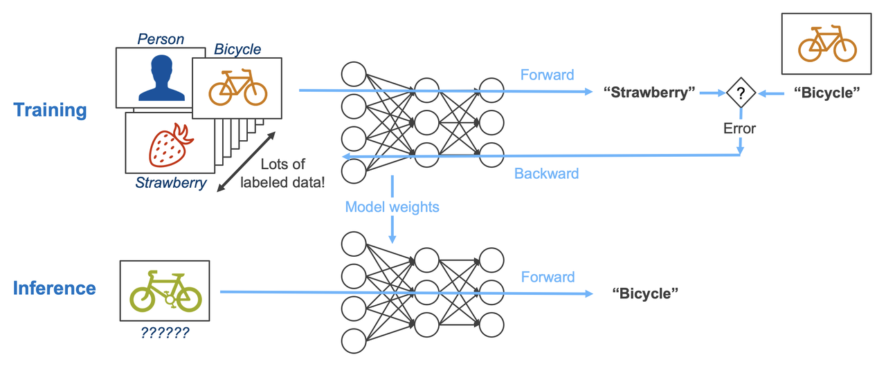

# Training vs Inference

### Training Phase
- Model sees data repeatedly
- Loss is computed
- Parameters are updated
- Computationally expensive

### Inference Phase
- Model parameters are frozen
- No learning happens
- Only predictions are made
- Fast and cheap

Real-world insight:
> Production systems almost never train models live.

