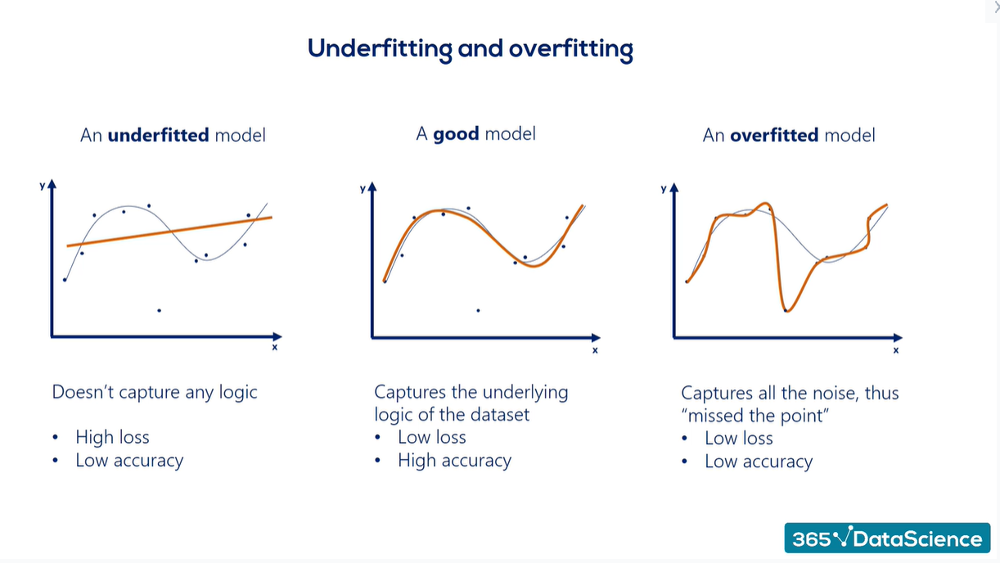

# Why Machine Learning Models Fail

ML failures are systematic, not mysterious.

The major reasons for failure of a ML Model include:

***Overfitting***
- Model memorizes training data
- Performs poorly on new data

***Underfitting***
- Model too simple
- Cannot capture patterns

***Poor Features***
- Model never sees useful signals

***Data Leakage***
- Training accidentally includes future information
- Metrics look great, real-world performance collapses

> A good model is one that fails gracefully, not one that scores highest.

